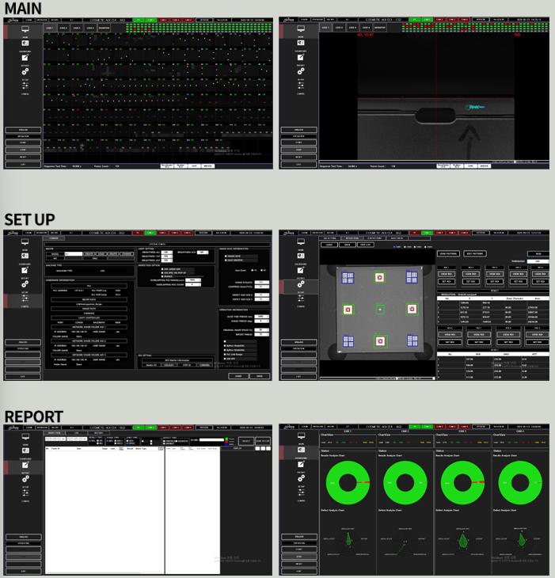

# AOI 휴대폰 케이스 검사 프로그램

## 📘 프로젝트 소개

휴대폰 케이스의 외관을 검사하여 표면 스크래치, 찍힘 등 Cosmetic Defect 유무를 판단하는 AOI 프로그램입니다.

## 🧰 기술 스택

- C# (WinForms)
- MSSQL
- Cognex VisonPro 9.23
- DeepCulus 딥러닝 비전 툴

## 💼 수행 업무

- 단독 개발

## ⚙️ 주요 기능
- Matrox MIL 프레임 그래버를 통해 Grab 된 영상 데이터 처리 및 외관 검사 수행 후 결과 실시간 시각화
- 검사 정확도 향상을 위한 기준점 설정 기능 (Calibration)
- 160개 포지션 별로 조명 값을 달리 적용할 수 있도록 시리얼 통신(RS232) 기반 스트로브 제어 기능
- MS-SQL 이용 검사 결과 저장 및 REPORT, DASHBOARD 기능

## 🖼️ 프로그램 UI


#  🧩 프로세스

## 시스템 구조
```
ProcessMain
├── DeviceCamera
├── DeviceLightController
├── DeviceServer
└── ProcessSequence
    └── DeepCulus
```

## 통신 프로세스

### 1. Start 신호 수신
```
제어 PC → [TCP/IP] → DeviceServer: Start 신호
```
- Camera와 LightController 준비 상태로 전환
- 제어 PC로 Return 응답

### 2. Trigger 신호 수신 및 검사 실행
```
제어 PC → [TCP/IP] → DeviceServer: Trigger 신호
```
**ProcessSequence 실행:**
1. DeviceCamera를 통해 이미지 촬영
2. 촬영된 이미지를 DeepCulus 모델에 입력
3. 추론 결과를 Main 창에 출력

### 3. Stop 신호 수신 및 결과 전송
```
제어 PC → [TCP/IP] → DeviceServer: Stop 신호
```
- 검사 결과(OK/NG_NG명)를 제어 PC로 Return
- 결과 데이터 저장

## 시퀀스 다이어그램
```
제어 PC          DeviceServer    ProcessSequence    Camera/Light    DeepCulus        MainForm 
   |                  |                  |                |              |              |
   |---Start--------->|                  |                |              |              |
   |                  |----------------->|--------------->|              |              |
   |                  |                  |    준비 완료    |              |              |
   |<---Return--------|                  |                |              |              |
   |                  |                  |                |              |              |
   |---Trigger------->|                  |                |              |              |
   |                  |----------------->|                |              |              |
   |                  |                  |---촬영-------->|              |              |
   |                  |                  |<--이미지-------|              |              |
   |                  |                  |----------------------------------이미지 출력->|
   |                  |                  |---추론----------------------->|              |
   |                  |                  |<--결과------------------------|
   |                  |                  |-----------------------------------결과 출력->|
   |                  |                  |                |              |              |
   |---Stop---------->|                  |                |              |              |
   |<--OK/NG_NG명-----|                  |                |              |              |
   |                  |---결과 저장----->|                |              |              |
```

## 주요 컴포넌트 역할

| 컴포넌트 | 역할 |
|---------|------|
| **DeviceServer** | 제어 PC와의 TCP/IP 통신 담당 |
| **DeviceCamera** | 이미지 촬영 |
| **DeviceLightController** | 조명 제어 |
| **ProcessSequence** | 검사 시퀀스 전체 관리 및 실행 |
| **DeepCulus** | AI 모델 추론 |

## 🧠 프로젝트 회고

프로세스상 각 카메라 별로 160장, 총 640장의 이미지를 24초 이내에 처리해야 했으나, 초기 구현 단계에서는 연산량이 많아 TactTime을 초과하는 문제가 있었습니다.

이를 해결하기 위해 다음과 같은 방법을 적용했습니다:

- **입력 이미지 축소**: 가로, 세로 1/2씩 축소하여 총 1/4 크기로 처리
- **모델 최적화**: Deep Learning 모델에 TensorRT 적용하여 추론 속도 가속
- **멀티 스레드 처리**: Image Display, Result Display, 이미지 저장 및 검사 결과 저장을 별도 쓰레드에서 병렬 처리하여 UI 갱신이 전체 Tact Time에 영향을 주지 않도록 개선

또한 제품 특정 부위의 각도 검출 시, 딥러닝 모델 학습에서 과도한 Data Augmentation으로 인해 한계가 있었습니다.  
따라서 해당 부분은 **Rule-Based 알고리즘**을 적용하여 안정적이고 신뢰성 있는 결과를 얻었습니다:

- 특정 부위를 Blob화 → Pattern화 → 각도 검출 과정으로 처리
